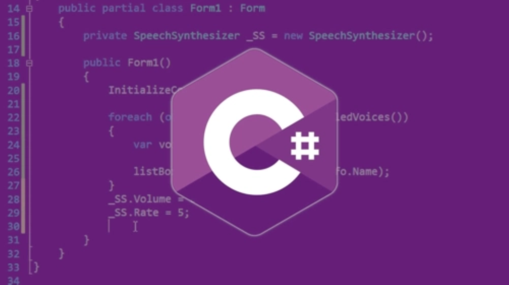

# C#语言程序设计



## 一、C#基础语法

### 1.Hello,World！

```c#
using System;//System是一个命名空间，using关键字用于引入命名空间

namespace HelloWorld//命名空间，用于对代码进行分类
{
    class Program
    {
        static void Main(string[] args)
        {
            Console.WriteLine("Hello World!");
            // Console.WriteLine("Hello World! 换行");
            // Console.Write("Hello World! 不换行");
        }
    }
}
//单行注释
/*
  多行注释
*/
```
> 程序的基本要点总结
* 注释快捷键
  * 注释所选行：Ctrl+k Ctrl+c
  * 对所选行解除注释：Ctrl+k Ctrl+u
  * 多行注释不可嵌套
* 一般一行放一条语句，也可以多条语句放在同一行，但是无论如何，在每条语句末尾都必须加上英文分号
* Main()方法是程序执行的入口
  * 不可改名
  * 必须是static void修饰的
> C#的编译过程
* 代码(.cs) -> 程序集(.exe .dll)
* 程序集在运行的时候才会被编译成机器指令（JIT即时编译）

### 2.变量与常量

#### （1）变量的声明和赋值

```c#
//变量的声明
int age;
double length;

//变量的赋值
age = 21;
length = 18.4;

//输出变量的值
Console.WriteLine(age);
Console.WriteLine(length);
```
> 变量的命名规则
* 由a-z、A-Z、数字和下划线组成
* 不能以数字开头
* C#严格区分大小写
> 注意事项
* 变量必须先声明再使用，局部变量又要求先初始化再使用
* 变量的命名应当尽量保证 “见名知义”
* 某个类型的变量只能存储对应类型的数据
* 赋值号左边**只能是变量、属性或索引器**，不可以是表达式
* 同一个变量，多次赋值，**只会保留最后一次赋值的数据**，之前的都会被覆盖掉

#### （2）数据类型

> 数值类型

> 字符和字符串
* 字符类型：char
  * char charVar = 'c';
  * 字符类型数据有且只有一个字符，这个字符需要放在一对英文的单引号内
* 字符串类型：String

> 引用类型

#### （3）C#常量

|运算转义序列| 含义          |
|-----------|--------------|
|   \\\     | \\字符        |
|   \\'     | '字符         |
|   \\n     | 换行符        |
|   \\r     | 回车，但不换行 |
|   \\t     | 水平制表符     |
|   \\v     | 垂直制表符     |
|   \\a     | Alert或Bell，操作系统会有提示音|


## 二、C#面向对象

## 三、C#高级编程