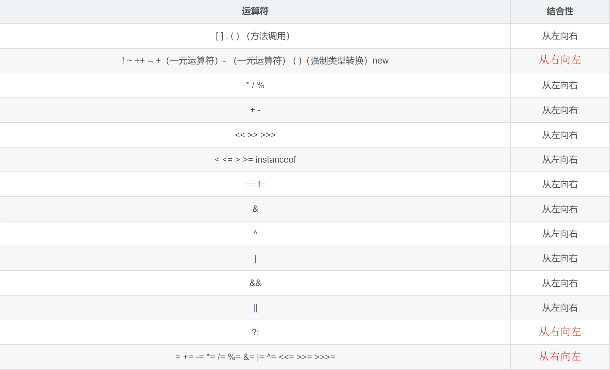

# Java程序设计语言

## 一、Java基础语法

### 1.Hello,World

```java
public class Hello{
    public static void main(String[] args){
        System.out.println("Hello,World!");
    }
}
```

#### （1）注释

```Java
//单行注释
/*
    多行
    注释
    多行注释不允许嵌套
*/
/**
    文档
    注释
    命令：javadoc -d dir_name -author -version hello.java  自动生成程序的帮助文档
*/
```

#### （2）关键字和保留字

* 关键字
	* 用于定义数据类型的关键字：class、interface、enum、byte、short、int、long、float、double、char、boolean、void
	* 用于定义流程控制的关键字：if、else、switch、case、default、while、do、for、break、continue、return
	* 用于定义访问权限修饰符的关键字：private、protected、public
	* 用于定义类、函数、变量修饰符的关键字：abstract、final、static、synchronized
	* 用于定义类与类之间关系的关键字：extends、implements
	* 用于定义建立实例及应用实例、判断实例的关键字：new、this、super、instanceof
	* 用于处理异常的关键字：try、catch、finally、throw、throws
	* 用于包的关键字：package、import
	* 其他修饰符关键字：native、strictfp、transient、volatile、assert
	* 用于定义市局类型值的字面值：true、false、null
* 保留字
	* 现有的Java版本尚未使用但是以后的版本可能会作为关键字使用。
	* 自己命名标识符时，要避免使用保留字。
	* 例如：goto、const

#### （3）标识符的命名

* 标识符命名规则
	* 只能由26个英文字母大小写、0-9、\_或$组成，且不能以数字开头
	* 不能使用关键字或保留字，但是可以包含关键字或保留字
	* Java严格区分大小写，不限制分隔符的长度，但是标识符不能包含空格
* 标识符命名规范(推荐但不强制)
	* 包名：多单词组成时所字母都小写
	* 类名、接口名：多单词组成时每个单词的首字符大写
	* 变量名、方法名：多单词组成时，除第一个单词之外每一个单词的首字母都大写
	* 常量名：每一个字母都大写，多单词时每个单词之间用_连接

### 2.数据类型

#### （1）变量

> 变量：其实就是内存中的一段存储区域，能够在同一个范围内不断变化，是程序的最基本的存储单元

*  Java中的变量必须先声明并初始化之后使用，因为只有声明后这个变量才会被在内存中加载
* 变量都定义在其作用域内，在作用域内是有效的，其实作用域就是声明这个变量时所在的大括号内
* 同一个作用域内不可以声明两个同名的变量，同一个变量不可以在同一个作用域内多次定义

> 变量的分类

* 局部变量：定义在方法的形参列表或方法体内的变量
* 成员变量：定义在类的{ }内部的变量

#### （2）基本数据类型

> 数值型：

* 整数类型：byte(1个字节)、short(2个字节)、int(4个字节)、long(8个字节)
* 浮点类型：float(4个字节)、double(8个字节)
* 说明：
	* 如果程序中给一个基本数据剋行变量的值超过其数据类型的存储范围，则编译不过
	* 整型变量通常使用int：因为在java中int是整型的默认存储方式，所以long型变量赋值时必须加以L或l结尾
	* 浮点型变量通常使用double：因为在java中double是浮点型的默认存储方式，所以float型变量赋值时必须加以F或f结尾
	* 浮点型数据可以利用’e’作为科学计数法中的’10’后面跟’10’的次数，来使用科学计数法的表示数值

> 字符型：

* char(2个字节)
* char c1 = ‘a’;
* 说明：
	* java采用unicode编码，支持汉字、单位数字等各种字符
	* 表示字符常量的单引号内只能有一个字符，否则报语法错误，编译不过
	* 可以使用转义字符'\n'、'\t'等

> 布尔型

* boolean
* boolean类型的变量只能取这两个值之一：true或false

#### （3）引用数据类型

* 类：class
* 接口：interface
* 数组：[ ]
* 说明：
	* 字符串类型属于类类型，也就属于引用类型
	* 引用类型的变量，只可能存储两类值：null、地址值

#### （4）不同基本数据类型变量之间的运算

> **自动数据类型转换**：容量小的数据类型的变量与容量大的数据类型的数据类型的变量做运算时，结果自动提升为容量大的数据类型。

* 容量从小到大排序：(byte 、char、 short) < int < long < float < double
* 说明：
	* 此处的容量大小是表示的数的范围容量大小，而不是占用的内存空间的大小
	* 当byte、char、short三个类型的变量之间进行运算时，**结果的类型都一定会是int**，同类型相互运算时也是这样

> 强制数据类型转换

* double doubleVar = 12.9;
* int intVar = (int)doubleVar;
* 说明：
	* 浮点型向整形强制类型转换，使用截取整数部分的方式(俗称”截断操作“)，而不是四舍五入，转换之后数据的精度可能降低，称为精度损失
	* 变量向数值范围不够的数据强制类型转换，并不会编译报错
	* 整型常量默认是int型，浮点型常量默认是double型

#### （5）String变量的使用

* String属于引用数据类型
```Java
String stringVar = "HelloWorld";
System.out.println(stringVar);
```
* 提取一个字符串中的某个字符：
```Java
char charVar_1 = stringVar.charAt(0);
char charVar_2 = stringVar.charAt(1);
char charVar_3 = stringVar.charAt(2);
char charVar_4 = stringVar.charAt(3);
char charVar_5 = stringVar.charAt(4);
```
* String类型的""内可以只有一个字符，也可以什么都没有,但是char类型的’’内必须有且仅有一个字符，可以是一个空格
* String可以分别和8种基本的数据类型进行运算，但是都只能是连接运算

### 3.运算符

#### （1）算术运算符

|运算符   |   运算     |        范例        |     结果      |
|--------|------------|--------------------|---------------|
|  +     |    正号    |         +3         |       3       |
|   -    |    负号    |     b = 4; - b     |      -4       |
|   +    |     加     |        5+5         |      10       |
|   -    |     减     |       6 - 4        |       2       |
|   *    |     乘     |       3 * 4        |      12       |
|   /    |     除     |       5 / 5        |       1       |
|   %    |    取模    |       7 % 5        |       2       |
|   ++   |    自增    |  var = 10; var++   |      11       |
|   --   |    自减    |  var = 10; var--   |       9       |
|   +    | 字符串拼接 | "hello," + "world" | "hello,world" |

* 整数之间的除法运算的结果必须是整数（就是把小数点及小数点后面的全部去掉）
* 如果想要通过整数之间的除法而得到精确结果，那么需要
* 整数间%运算得到余数，结果的符号与被模数一直
* 整数间/运算都得到商
* 自增自减运算符
	* 左自增和左自减是在变量发挥作用之前使得变量的值增加或减去1
	* 右自增和右自减是在变量发挥作用之后使得变量的值增加或减去1
	* 最后的结果，变量的值都会增加或减去1
	* 自增与自减不会改变变量本身的数据类型

#### （2）赋值运算符

|  符号   |    运算   |        范例        |     结果      |
|--------|-----------|--------------------|----------------|
|   +    |    正号    |         +3         |       3       |
|   +=   |    负号    |     b = 4; - b     |      -4       |
|   -=   |     加     |        5+5         |      10       |
|   =    |     乘     |       3 * 4        |      12       |
|   %=   |     除     |       5 / 5        |       1       |
|   \*=   |     减     |       6 - 4        |       2       |

* 当赋值运算符两端数据类型不一致时，可以使用自动类型转换或强制类型转换原则进行处理
* 赋值运算表达式的返回值（运算结果）就是赋值号所传递的那个值，所以**赋值运算支持连续赋值**

#### （3）比较运算符

* 运算符： \>  <  ==  !=  >=  =<  instanceof()
* 比较运算符的运算结果只能是布尔类型的值(true、false)

#### （4）逻辑运算符

|  符号  |     运算     |        范例        |     结果      |
| ------ | ------------|--------------------|---------------|
|   &    |    逻辑与    |         +3         |       3       |
|   \|    |    逻辑或    |     b = 4; - b     |      -4       |
|   !    |    逻辑非    |        5+5         |      10       |
|   &&   |    短路与    |       6 - 4        |       2       |
|  \|\|  |    短路或    |       3 * 4        |      12       |
|    ^   |    逻辑异或  |       5 / 5        |       1       |

* 逻辑运算符只能对布尔型变量进行操作
* 短路就意味着如果仅凭运算符前面的表达式就可以准确得出本次逻辑运算的结果，那么就不会再执行运算符右侧的表达式来获得该表达式的返回值再用于逻辑判断
* 实际开发之中一般优先使用短路

#### （5）位运算符

|运算符 |操作      |
|------|----------|
| <<   | 左移     |
| \>>   | 右移     |
| \>>>  | 无符号右移|
|  &   | 与运算    |
|  \|   | 或运算    |
|  ^   | 异或运算  |
|  ~   | 取反运算  |

#### （6）三元运算符 

* **(条件表达式) ? 表达式1 : 表达式2**
* 如果条件表达式的值为true则执行表达式1，否则执行表达式2
* 条件表达式的结果为布尔类型的值

#### （7）运算符优先级

|运算符 | 结合性   |
|------|----------|
| <<   | 左移     |
| \>>   | 右移     |
| \>>>  | 无符号右移 |
|  &   | 与运算    |
|  \|   | 或运算    |
|  ^   | 异或运算  |
|  ~   | 取反运算  |



### 4.流程控制

#### （1）if—else分支

* 结构1：
```java
if(条件表达式){
  程序语句块1;
}
```
* 结构2：
```java
if(条件表达式){
  程序语句块1;
}else{
  程序语句块2;
}
```
* 结构3：
```java
if(条件表达式1){
  程序语句块1;
}else if(条件表达式2){
  程序语句块2;
}else{
    程序语句块3;
}
```
* 说明：
	* else结构是可选的
	* 如果多个条件表达式之间是“互斥的关系”（或没有交集的关系），那个判断或执行语句声明在上面还是下面，是无所谓的

#### （2）switch—case分支

```java
switch(表达式){
  case 常量1: 当条件表达式的值为常量1时执行的语句;break;
  case 常量2: 当条件表达式的值为常量1时执行的语句;break;
  .
  .
  .
  case 常量N: 当条件表达式的值为常量1时执行的语句;break;
  default: 当条件表达式的值不是以上的任何一个常量值时执行的语句;
}
```
* 如果想要实现多选一的操作，那么应该在每一个case中都使用break;语句
* 表达式的值只能是这6中类型之一：byte、short、char、int、枚举类型(JDK5.0开始枚举类型才允许作为表达式)、String类型(JDK7.0开始String类型才允许作为表达式)
* case后面绝对禁止写范围
* default结构时可选的
* 如果结构中的多个case的执行语句相同，则可以考虑合并
* 同一个结构中不同的case下不可以重复定义同名变量

#### （3）循环结构

* for循环
```java
for(初始化条件;循环条件;迭代条件){
    循环体;
}
```
* while循环
```java
while(条件表达式){
    程序语句块;
}
```
* do-while循环
```java
do{
  循环体;
  迭代条件;
}while(循环条件);
//循环体至少会被执行一次
```
* 特殊关键字的使用
	* break：用于switch-case结构和循环结构，用于直接跳出switch语句或结束当前循环
	* continue：仅用于循环结构，用于结束当前循环并直接开始下一次循环
	* 这两个关键字语句的后面都不能有需要执行的语句
* 说明：
	* for循环和while循环完全可以相互转化
	* for循环和while循环的初始化条件的作用范围不一样
		* for循环：初始化条件只在循环内有效
		* while循环：可以对循环控制变量在整个程序范围内产生影响（因为其循环控制变量是在循环结构外部定义的，其生命周期为从变量生命声明开始到整个方法体的末尾结束）
	* 结束循环的方法
		* 在循环体内执行break;语句
		* 循环条件为false
	* 嵌套循环：将一个循环结构A声明在另一个循环结构B的循环体中
		* A成为内层循环，B称为外层循环
		* 内层循环遍历1遍，则外层循环执行一次

### 5.数组

#### （1）关于Java数组

* 数组属于引用类型的，数组的元素既可以是基本数据类型也可以是引用数据类型。
* 创建数组对象会在内存中开辟一整块连续空间，而数组名中引用的是这块连续空间的首地址。
* 数组的长度一旦确定，就不能修改。
* 数组的分类: 
	* 按照维度：一维数组、二维数组、三维数组......
	* 按照数据类型：基本数据类型元素的数组、引用数据类型元素的数组（即对象数组）

#### （2）一维数组的使用

* 声明和初始化
```java
//声明：
int[] arrayVar;

//静态初始化：数组的初始化和数据元素的赋值同时进行
int[] arrayVar = new int[]{1123,3432,34343,23232};

//动态初始化：数组的初始化和数据元素的赋值分开进行
int[] arrayVar = new int[4];

/*注意事项：
	1.声明并初始化操作，只有上面的两种情况是正确的,不能把两种方式混合在一起
	2.数组一旦初始化完成，其长度就确定了
*/
```
* 调用指定位置的元素
```java
arrayVar[0] = 10;
arrayVar[1] = 20;
arrayVar[2] = 30;

/*注意事项：
	1.数组的下标是从0开始的，到“数组的长度-1”结束
	2.如果数组的角标超出“数组的长度-1”时，编译时不会报错，但是运行时会报错
*/
```
* 获取数组长度
```java
//数组有一个属性叫做length
System.out.println("arrayVar.length");//打印出数组的长度
```
* 遍历数组
```Java
for(int i=0;i < arrayVar.length;i++){
	visit(arrayVar[i]);
}
```
* 数组元素的默认初始化值
	* 整型数据元素：0
	* 浮点型数据元素：0.0
	* 字符型数据元素：0或\u0000而非'0'，输出时空格效果，但是实际上并非空格
	* 布尔类型数据元素：false
	* 字符串型数据元素：null而不是"null"，包括字符串型数据元素在内的所有引用类型的数据元素的默认初始化值都是null
* 内存解析
&emsp;&emsp;作为局部变量的数组名变量存储在栈(stack)中，数组的数据元素存储在堆里组成一段连续的内存空间。数组名变量通过指向这段连续的内存空间首地址值，而与这段内存空间产生联系。  
&emsp;&emsp;对于一个已经经过了初始化了的数组名变量，它原先关联于一段内存空间A，我们再开辟一段新的内存空间B，并将它赋值给这个数组名变量，那么这个数组名变量就会关联于这段新的内存空间B，而不再关联于原来的那一段内存空间A，B中的数组元素可以通过这个数组名调用，A中的数组元素不再能通过这个数组名进行调用，这段内存空间A就会是一段没有被指针指向的内存空间也就成为了垃圾，从而会在在某一个不确定的时间被Java的垃圾回收机制自动销毁。

#### （3）二维数组的使用

> &emsp;&emsp;数据元素的数据类型为数组的数组称为二维数组。其本质上是一维数组A作为另一个一维数组B的元素而存在，从数组底层的运行机制来看，其实没有多维数组。

* 声明和初始化
```Java
//声明：
int[][] arrayVar;

//静态初始化：
int[][] arrayVar = new int[][]{{1,3,2,1},{3,42,1,2,23},{1,2},{2,5,5}};  正确

//动态初始化:
	//二维数组每个子数组的长度可以互不相同
	//二维数组在进行动态初始化时子数组的长度可以不指定，但是必须指定外层数组的数组长度
int[][] arrayVar = new int[3][];  //正确
int[][] arrayVar = new int[][4];  //错误
```
* 调用数组的指定位置的元素
```Java
//调取外层数组元素：
arrayVar[行下标]

//调取内层数组元素：
arrayVar[行下标][列下标]
```
* 获取数组的长度
	* 因为二维数组本质上是存储着一个又一个数组名变量的一维数组，所以二维数组的长度就是这个二维数组的外层数组的长度，即"行角标+1"。 
	* 可以通过length属性进行查看
* 数组元素的遍历
```Java
//使用二层嵌套循环结构
```
* 二维数组元素的默认初始化值
	* 情况一：指定了内层数组的长度
		* 外层数组元素：地址值
			* \[I@7ea987ac : 1个"\["代表这是一个一维数组，@后面就是16进制形式的地址值
			* \[\[I@12a3a380 ：2个"\["代表这是一个二维数组，@后面就是16进制形式的地址值
		* 内层数组元素：默认初始化值的情况与一维数组元素的默认初始化值的情况一致
	* 情况二：未指定内层数组的长度
		* 外层数组元素：null，无论是什么类型的二维数组，只要内层数组的长度在数组初始化时没有指定，那么外层数组的默认初始化值就一定是null
		* 内层数组元素：没有默认初始化值，不能调用，强行使用的话，编译不会报错，但是执行会报错：使用了一个空指针
* 二维数组的内存解析
静态初始化：

动态初始化：

声明了一个二维数组名变量之后

#### （4）Arrays工具类的使用：

```Java
import java.util.Arrays;

boolean equalsJudge = Arrarys.equals(arraysVar_1,arrayVar_2);
//比较两个数组是否相同，相同则返回true,不相同则返回false

String detials = Arrays.toString(arrayVar);
//输出指定数组内的所有元素

Arrays.fill(arrayVar,10);
//把指定数组中的所有元素都替换成10

Arrays.sort(arrayVar);
//实现将数组内的元素从左到右按照从小到大进行排列

int index = Arrays.binarySearch(arrayVar,23);
//二分法查找，只针对于有序的数组，输出所查的元素的对应的角标，如果说这个数组内存在多个相同的目标值则会返回最左侧的目标值的地址，如果数组内没有目标值则会返回一个负数
```

#### （5）数组常见异常：

* 数组下标越界：ArrayIndexOutOfBoundsExcetion
```Java
int[] arrayVar =  new int[10];
System.out.println(arrayVar[10]);
```
* 空指针异常：NullPointerException
```Java
//情况一：
int[] arrayVar = new int[]{1,2,3};
arrayVar[0] = null;
System.out.println(arrayVar[0]);

//情况二：
int[][] arrayVar = new int[4][];
System.out.println(arrayVar[0][0]);

//情况三：
String[] arrayVar = new String[]{"AA","BB","CC"};
arrayVar[0] = null;
System.out.println(arrayVar[0].toString());
```

## 二、Java面向对象

> Java类及类成员：属性、方法、构造器；代码块、内部类  
> 面向对象的三大特征：封装性、继承性、多态性、（抽象性）  
> 其它关键字：this、super、static、final、abstract、interface、package、import等

> 权限修饰符(从小到大排列)：private、缺省、protected、public  
> 这4种权限可以用来修饰类及类的内部结构（属性、方法、构造器、内部类，只有这4种情况）
 
* 对于类的成员：4种权限修饰符都可以用来修饰类的内部结构：属性、方法、构造器、内部类
  
|  修饰符  | 类内部 | 同一个包下 | 不同包的子类 | 同一个工程 |
|---------| -------|-----------|-------------|-----------|
| private |  yes   |    no     |     no      |    no     |
|   缺省  |  yes   |    yes    |      no     |    no     |
|protected|  yes   |    yes    |      yes    |    no     |
|public   |  yes   |    yes    |      yes    |   yes     |

* 对于类：类只能用public和缺省两种权限修饰符修饰
  * public：类可以在任意的地方被访问
  * 缺省：类只可以被同一个包内部的类访问
  * 同一个包内不可以定义多个同名的类，在另一个包内调用时需要在源代码文件的开头使用“import 包名.类名”，进行引包。

### 1.面向对象的两个基本要素——类和对象

> **类**是对一类事物的描述，是抽象的概念上的定义  
> **对象**是实际存在的该类事物的每个具体的个体，因而也称为实例

* 类的非静态成员其实会完全映射给通过这个类而造出的对象
* 面向对象程序设计的重点在于对类的设计，也就是类的成员的设计
* 类和对象的使用：
  * 创建类并设计类的成员
  * 创建类的对象
  * 通过"对象.属性"或"对象.方法"来调用对象的结构

#### （1）类的属性

属性：也就是成员变量(field)，也叫"域" 或"字段"
> 属性(成员变量)与局部变量的对比：
* 相同点：
  * 定义变量的格式完全相同
  * 先声明后使用
  * 都有其对应的作用域
* 不同点：
  * 在类中声明的位置不同：属性直接定义在类的{ }中，而局部变量声明在类中的方法内、方法形参、代码块内、构造器形参、构造器内部的变量
  * 关于权限修饰符的不同：对于属性，可以在声明属性时，指明其权限，使用权限修饰符；对于局部变量，不可以使用权限修饰符
  * 默认初始化值：对于属性，根据其类型，都有默认初始化值；对于局部变量，没有默认初始化值，一定要在调用之前显式的赋值。特别的，形参在调用时赋值即可。
  * 在内存中加载的位置不同：属性加载到堆里面；局部变量加载到栈空间

#### （2）类的方法

> 方法：也就是成员方法(method)，也叫"函数"

> 声明：

```Java
权限修饰符 返回值类型 方法名(形参列表) [throws 异常类型]{
	方法体
}
//static、final、abstract 放在权限修饰符和返回值类型之间
//方法可以有形参也可以没有形参
```

> 返回值：
* return关键字
  * 后面跟变量或常量，用来指定返回的数据。
  * 而一旦进行了返回，对方法体的执行也就结束了，从而也标志着方法执行完毕。
* 方法名左侧的关键字指定了方法的返回值类型，void表示这个方法没有返回值
  * 如果方法有返回值，则必须在方法声明时指定返回值的类型，并在方法体中使用return关键字来返回指定类型的变量或常量，并且需要保证在任何条件下都会执行到正确的return语句
  * 如果方法没有返回值，则在方法声明时使用关键字void来表示；通常，没有返回值的方法中不需要使用return语句的，但是，如果使用的话，只能使用"return;"来表示结束此方法的意思。      return后不可以声明表达式。

> 形参列表格式：数据类型_1 形参_1,数据类型_2 形参_2,数据类型_3 形参_3,...

> 方法的使用：

* 方法内是可以调用在同一个类内声明的属性和方法，特殊的，方法A中又调用了方法A，称为递归方法
* 不能在一个方法中再去定义一个方法

> 方法的重载：

* 在一个类当中，允许存在一个以上的同名方法，只要它们的参数个数或者参数类型不同即可
* 在调用时通过方法列表来对重载的方法进行区分，重载的两个同名方法的形参列表必须不相同
  * 两同一不同：同一个类、相同方法名；形参列表不同
  * 参数列表中的各个数据类型形参的位置顺序不同也是列表不同
  * 区分重载方法的关键点在于且仅仅在于参数列表的不同，权限修饰符、返回值类型都不能作为判别条件

> 可变个数形参的方法：这是JDK5.0新增的特性

* 可变个数形参的格式：数据类型 ... 变量名
* 当调用可变个数形参的方法时，传入的参数的个数可以是0个、1个、2个...，但是这个写参数必须都是一个指定的类型
* 可变个数的形参方法与本类中方法名相同，形参不同的方法名之间构成重载
* 可变个数的形参方法与本类中方法名相同，形参类型相同类型的数组的其它方法名之间不构成重载
* 其实就相当于是一个指定类型的数组名变量，即
```Java
public void show (String ... str){

}
```
与
```Java
public void show (String[] str){

}
```
这两种写法在本质上是一个意思
* 可变形参在一个方法的形参中必须声明在末尾，且最多只能有一个

> 方法参数的传递机制：

* 关于变量的赋值：
  * 如果变量是基本数据类型，此时赋值的变量所保存的数据值
  * 如果变量是引用数据类型，此时赋值的是变量所保存的数据的地址值
* 方法的形参的传递机制：值传递
  * 形参：方法定义时声明在小括号内的参数
  * 实参：方法调用时，实际传递给形参的数据
* 值传递机制：
 如果参数是基本数据类型，此时参数赋值给形参的是实参变量存储的数据值
 如果参数是应用数据类型，此时参数赋值给形参的是实参变量存储的地址值

> 递归方法：在一个方法的方法体中调用方法本身

> 方法的重写：在子类当中我们可以根据需要对从父类中继承而来的方法进行改造，也称为方法的重置、覆盖。在程序执行时子类的方法覆盖父类的方法。

* 子类继承了父类以后可以定义与父类中同名同参数的方法
* 重写以后，当创建子类对象以后，通过子类对象调用调用父类中同名同参数的方法时，实际执行得是子类重写父类的方法
* 规则：
  * 子类中重写的方法的方法名和形参列表与父类中被重写的方法的方法名和形参列表相同
  * 子类中重写的方法的权限修饰符需要不小于父类中被重写的方法的权限修饰符
  * 子类中不能重写父类中声明为private的方法
  * 返回值类型
    * 如果父类中的被重写的方法的返回只类型是void，则子类重写的方法的放回置也只能是void
    * 如果父类中的被重写的方法的返回值类型是void以外的一个引用数据类型A，则子类重写的方法的返回值类型可以是A类型或A类型的子类
    * 如果父类中的被重写的方法的返回值类型是void以外的一个基本类型B，则子类重写的方法的返回值类型必须是相同的基本数据类型B
  * 子类重写的方法抛出的异常类型不大于父类被重写的方法抛出的异常类型
  * 子类和父类中的同名同参数的方法要么都声明为非static的，要么都声明为static的(不叫”重写”了)，其实static的方法是不可以被重写的

#### （3）类的构造器：

> 构造器又叫构造方法、constructor
  
> 任何一个类都有构造器，用来创建对象、初始化对象的信息

* 如果没有显式的定义构造器，则系统默认提供一个空参的构造器
* 定义构造器的格式：权限修饰符 类名(形参列表) {}
* 在同一个类内可以定义多个构造器，这些构造器之间靠参数列表来加以区分，称作构造器的重载
* 一旦我们显式地定义了类的构造器(无论是否为空参构造器)，系统就不再提供默认的空参构造器了
* 一个类中，至少会有一个构造器
* 系统提供的默认空参构造器的权限修饰符与所处的类的权限修饰符相同

> this关键字：表示 ”当前对象” 或 ”当前正在构建的对象”

* “this.属性名”代表当前对象的属性：
* “this.方法名”代表当前对象的方法：
* 在类的方法中，我们可以使用”this.属性名”或”this.方法名”的方式，调用当前对象的属性或方法。但是我们通常都选择省略”this.”特殊情况下，如果同一个类内的属性和 方法的形参 重名，就必须显式的使用”this.属性名”的方式来表明该变量是属性而不是形参

#### （4）对象的使用：

> 创建类的对象：也就是类的实例化，也叫实例化类

```java
classNmae varName = new className();
varName.field_1 = 5;
varName.method();
```

> 多个对象之间的关系：

&emsp;&&emsp;如果创建了一个类的多个对象，则每个对象都独立的拥有一套类的属性（非static的），意味着如果我们修改一个对象的属性A，则不影响另一个对象的属性A的值。

> 每new一次才会造一个对象

&emsp;&emsp;同一个类的多个对象之间是属于数据类型相同的不同变量，是可以直接相互赋值的，本质上是将一个对象的地址值赋值给另一个对象，赋值之后这两个对象变量名中的地址指向同一个内存空间，在本质上是同一个对象，它们的变化是完全同步的。  
&emsp;&emsp;类中的属性有默认初始化值，这个默认初始化值的情况和数组是一致的。

> 对象的内存解析：

* 数组、非static的属性存储在堆中，static的属性存储在方法区
* 局部变量存储在栈中

> 匿名对象的使用:

如果我们创建的对象没有显式的赋给一个变量名，即为匿名对象:
```Java
new className.method_1();
new className.method_2();
//这两次匿名调用，调用的是两个不同的对象，也就是说一个匿名对象只能调用一次，不可以被第二次调用。
```

数据元素的数据类型为对象的对象数组的内存解析

### 2.封装与隐藏

## 三、Java高级编程

## 四、JavaWeb