# 软件测试技术

## 一、软件测试概述（基础理论）

### 1.软件可靠性问题

&emsp;&emsp;由于计算机硬件技术的进步，元器件可靠性的提高，硬件设计和验证技术的成熟，硬件故障相对显得次要了，**软件故障**正逐渐成为导致计算机系统失效和停机的主要因素

### 2.软件测试的目的和意义

> IEEE软件工程标准术语中给软件测试下的定义：

&emsp;&emsp;使用人工或者自动的手段来运行或测定某个系统的过程，其目的在于检测它是否满足规定的需求或是弄清预期结果与实际结果之间的差别。

> Grenford J.Myers的观点

* 软件测试是为了发现错误而执行程序的过程
* 测试是为了证明程序有错，而不是证明程序无错
* 一个好的测试用例在于它能发现至今尚未发现的错误
* 一个成功的测试是发现了至今未发现的错误

### 3.**软件测试的过程**

#### （1）软件测试分类

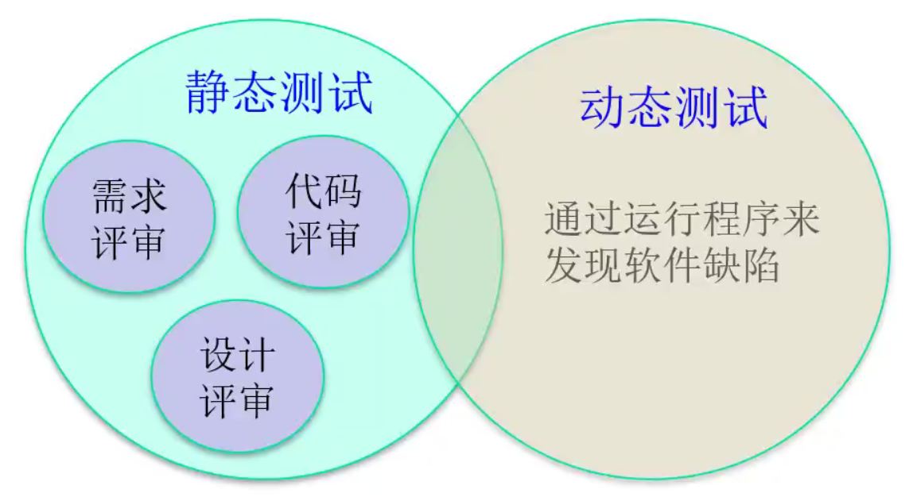
* 不需要运行代码 -> 静态测试
* 需要运行代码 -> 动态测试

#### （2）总述

#### （3）自底向上的软件测试过程

> **单元测试**：检测程序模块中有无故障存在
* 测试对象：软件设计的最小单位，与程序设计和编程实现关系密切
* 可以由开发人员在测试人员的指导下测试
* 最容易发现错误，且纠错成本最低

> **集成测试（组装测试）**：发现与**接口**有关的模块之间的问题
* 方法：**非增量式集成测试法**和**增量式集成测试法**
  * 非增量式：将所有测试好的单元同时集成在一起进行测试
  * 增量式：每对一个模块进行完单元测试就将该模块加入集成进行测试（更易于进行错误定位，推荐）

> **确认测试**：对照软件需求规格说明书，对软件产品进行评估以确定其是否满足软件需求的过程
* 结果：给出**结论性评价**（当前软件是否是一个合格的软件，提出一个缺陷清单）

> **系统测试**：针对系统中各个组成部分进行的综合性检验，证明系统的**性能**
* 测试人员要求：
  * 系统**开发人员**不能进行系统测试
  * 系统**开发组织**不能负责系统测试
  * 最好由用户来进行系统测试，但是用户没有相关经验
  * 或者由用户代表和开发人员共同组成的小组来进行测试
  * 也可以由一个独立的第三方机构进行测试（最理想）

> **验收测试**：向用户表明所开发的软件系统能够像用户所预定的那样工作
* 主要任务：
  * 明确

### 4.软件测试与软件开发的关系

#### （1）软件开发过程

#### （2）在软件开发中的作用

* 项目规划阶段
* 

#### （3）软件测试过程模型

> V模型

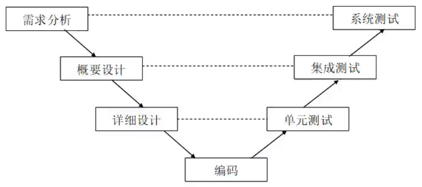

* 优点：每个测试阶段都对应于软件开发各个阶段的文档，非常明确的表明了测试的不同级别，清晰地展示了软件测试与开发之间的关系
* 缺点：在真正的开发测试过程中很难做到一一对应

> W模型

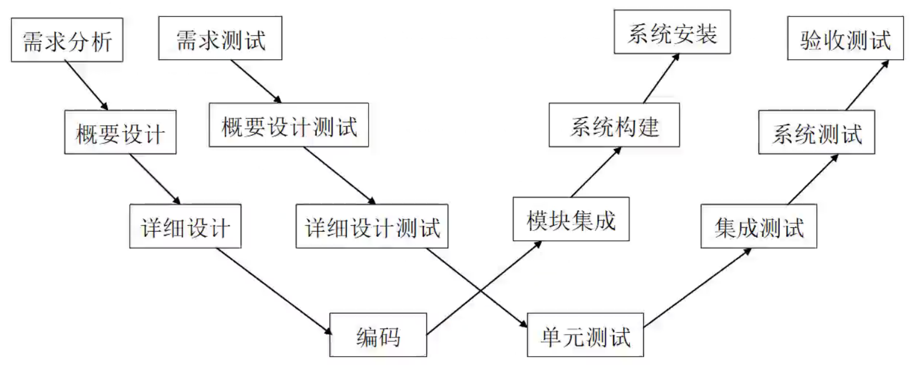

* 优点：
* 缺点：开发测试活动具有严格的先后要求

软件测试是伴随着我们的软件生命周期的

#### （4）软件测试环境的搭建

> 测试环境：指用来实际运行软件的环境

* 测试环境=硬件+软件+网络+数据准备+测试工具
  * 硬件：PC、笔记本、服务器
  * 软件：
  * 网络：网络环境、网络架构
  * 数据准备：数据量+真实性+健壮性
  * 测试工具：功能测试、性能测试、黑盒测试、白盒测试、评估、测试管理
* 注意事项：
  * 尽量模拟用户的真实使用环境
  * 测试环境中尽量不要安装其它与被测软件无关的软件，但是最好安装杀毒软件，以确保系统没有病毒
  * 测试环境应与开发环境独立

### 5.自动化测试概述
> 自动化测试

&emsp;&emsp;让被测试的软件自己运行起来，执行软件的功能；或者就是让其他的工具自己运行起来，去检查软件的内部和外部。

> 优势

* 可以执行手工测试相当困难或根本做不到的测试
* 具有一致性和可重复性
* 自动化脚本可完全复用
* 使软件更有信任度

> 劣势

* 自动化测试不可能完全取代手工测试

> 主流的测试方案

* 人机沟通的编程语言+机器操作的工具
* 功能自动化测试
* 

## 二、黑盒测试

### 1.基本概念
> &emsp;&emsp;黑盒测试是一种常用的软件测试方法，它将被测软件看作一个**打不开的黑盒**，主要根据功能需求设计测试用例，进行测试。  
> &emsp;&emsp;是一种从软件外部对软件实施的测试，也称功能测试或基于规格说明的测试。
* **目的**：尽可能多的发现软件的外部行为错误（用较少的用例去发现尽可能多的错误）
* **基本观点**：任何程序都可以看作是从输入定义域到输出值域的映射
  * 这种观点将被测程序看作一个打不开的黑盒，黑盒里面的内容（实现）是完全不知道的，只知道软件要做什么。
  * 因为无法看到盒子中的内容，所以不知道软件是如何实现的，也不关心黑盒里面的结构，只关心软件的输入数据和输出结果。
* 研究测试方法的原因：**穷举输入测试是不现实的**，我们需要认真研究测试方法，以便能开发出尽可能少的测试用例，发现尽可能多的软件故障。
* **黑盒测试的两个显著优点**:
  * ①与软件具体实现无关，所以如果软件实现发生了变化，测试用例仍然可以用
  * ②设计黑盒测试用例可以和软件实现同时进行（可以并行开发），因此可以压缩项目总的开发时间

### 2.等价类划分
> &emsp;完全不考虑程序的内部结构，只根据程序规格说明书对**输入**范围进行划分，把所有可能的输入数据，即程序输入域划分为**若干个互不相交的子集**，称为等价类，然后从每个等价类中选取少数具有代表性的**数据**作为测试用例，进行测试。

#### （1）等价类是输入域的某个子集

> 有效等价类
* 检验程序是否实现了规格说明预先规定的功能和性能

> 无效等价类

#### （2）划分等价类的方法

#### （3）划分方法的分类

> **弱一般等价类**：使用一个测试用例中的每个等价类的**一个**变量实现（不考虑无效值，测试用例使用每个等价类中的一个值，称为单缺陷假设）

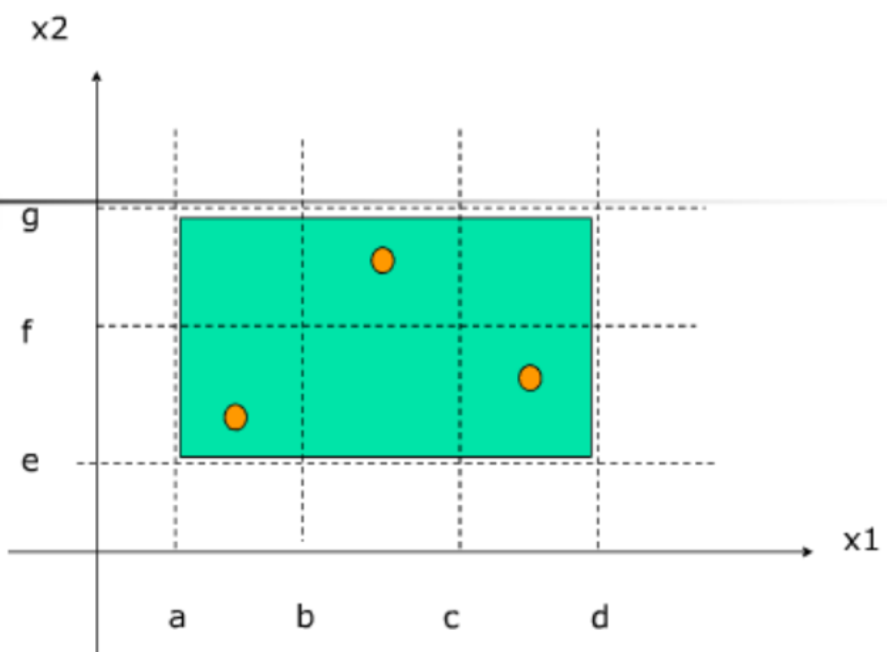

> **强一般等价类**：基于多缺陷假设，需要等价类（不考虑无效值）笛卡尔积的每个元素对应的测试用例

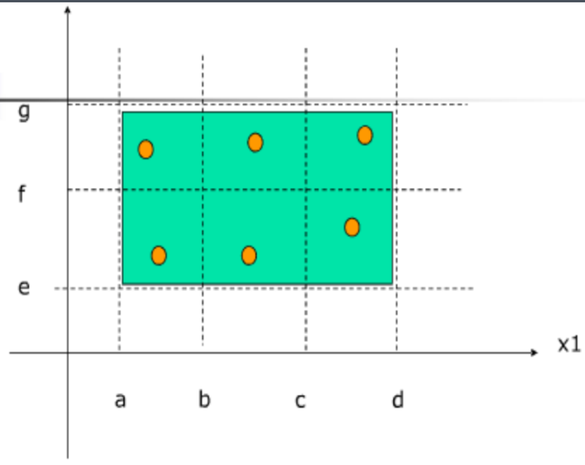

> **弱健壮等价类**：单假设缺陷、健壮（包括无效值）

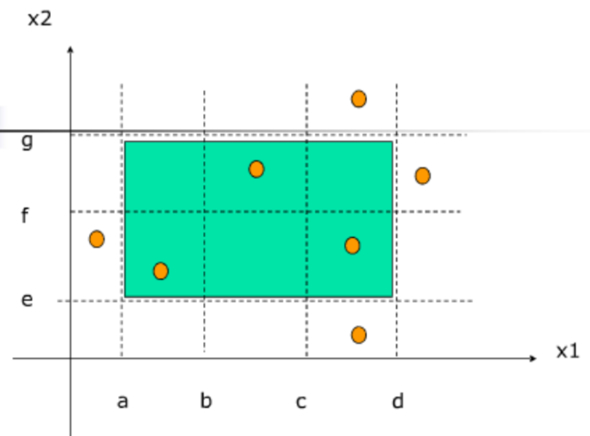

> **强健壮等价类**：基于多缺陷假设，从所有等价类的笛卡尔积的每一个元素（包括无效值）中获得测试用例

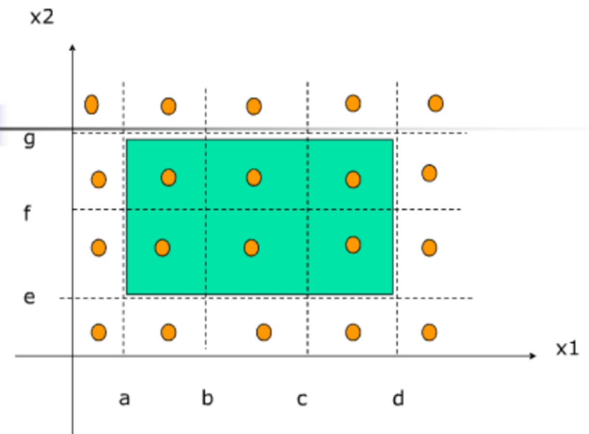

#### （4）等价类划分法的步骤

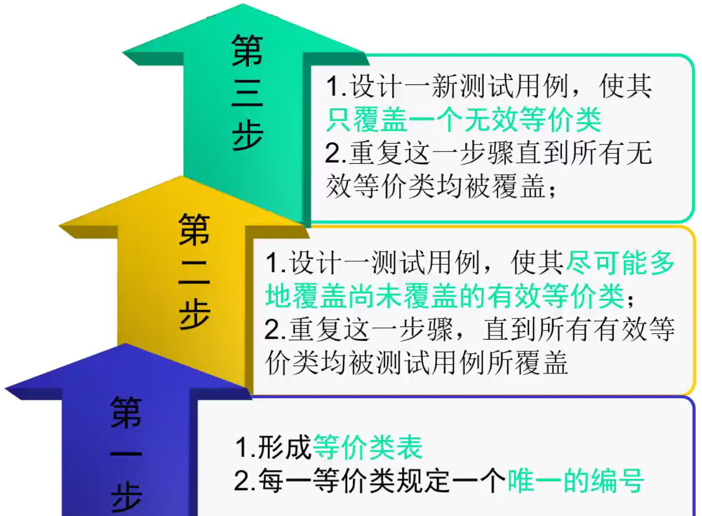
* 形成**等价类表**
  * 每一等价类规定一个**唯一的编号**
  * 设计一测试用例，时期尽可能多地覆盖

|  输入条件  |  有效等价类  |  无效等价类  |
| :-------: | :---------: | :----------: |
| username  | 字母开头（1）| 非字母开头（2） |

* 形成测试用例表

研究测试方法
常用的黑盒测试方法有等价类划分
、边界值分析、决策表
测试等，每种方法各有所长，我们应针对软件开发项目的具体特点，选择合适的测试方法，有效地解决软件开发中的测试问题。

黑盒测试是从用户观点出发的测试,其目的是尽可能发现软件的外部行为错误。在已知软件产
品功能的基础上，
检测软件功能能否按照需求规格说明书的规定正常工作，
是否有功能遗漏;
检测是否有人机交互错误，是否有数据结构和外部数据库
访问错误，是否能恰当地接收数据并保持外部信息（如数据库或文件）等的完整性;
检测行为、性能等特性是否满足要求等;检测程序初始化和终止方面的错误等。

优点

黑盒测试着眼于软件的外部特征，通过上述方面的检测，确定软件所实现的功能是否按照软件规格说明书的预期要求正常工作.

> 本章主要介绍几种常用的黑盒测试方法，并通过实例介绍各种方法的运用。

### 3.边界值分析法
> 大量的软件测试实践表明，故障往往出现在定义域或值域的边界上，而不是其内部。

#### （1）在等价类的基础上进行边界值测试
基本思想：  
&emsp;&emsp;选取正好等于、刚刚大于或刚刚小于等价类边界的值作为测试数据，而不是选取等价类中的典型值或任意值做为测试数据。

#### （2）边界值分析测试
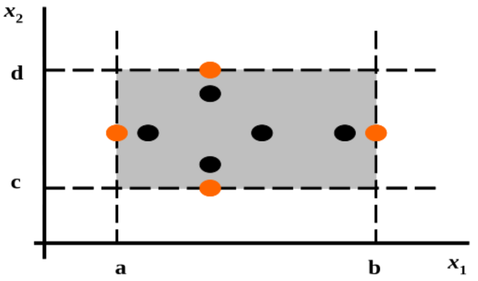
* n个输入条件，4n+1个测试用例

#### （3）健壮性边界值测试
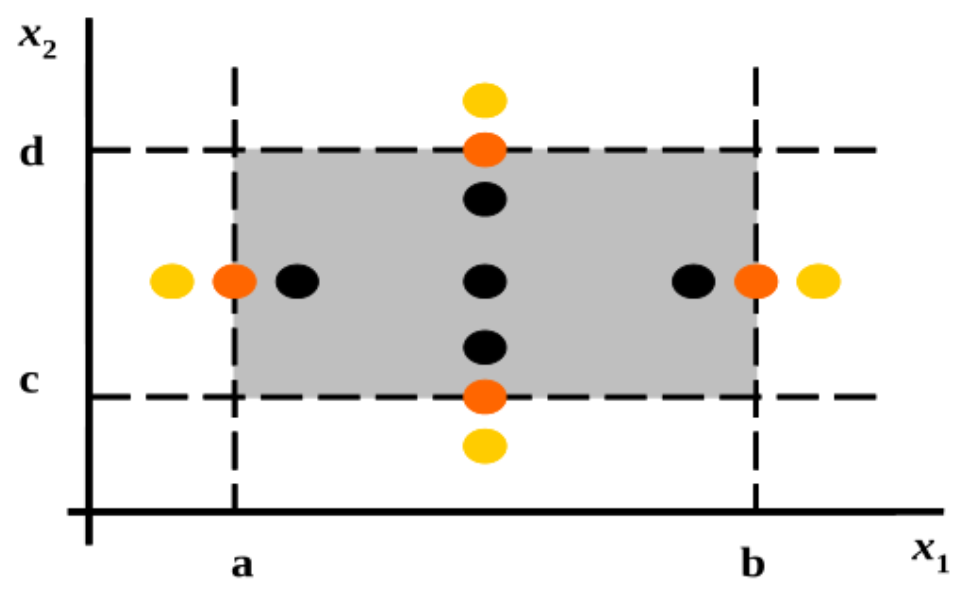
* n个输入条件，6n+1个测试用例

#### (4)原则
* 如果输入条件对取值范围进行了限定，则应以边界内部以及刚超出范围边界外的值作为测试用例。
* 如果对取值的个数进行了界定，则应分别以最大、稍小于最大、稍大于最大、最小、稍小于最小、稍大于最小个数作为测试用例。
* 对于输出条件，同样可以应用上面提到的两条原则来进行测试用例设计。
* 如果程序规格说明书中指明输入或者输出域是一个有序的集合，如顺序文件、表格等，则应注意选取有序集合中的第一个和最后一个元素作为测试用例。

### 4.因果图
> 适合于描述对于多种条件的组合，产生多个相应动作的测试方法

#### （1）因果图关系的表示
> 因果关系
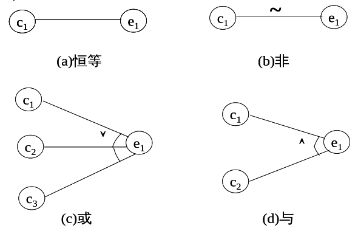

> 条件（原因）之间的约束关系
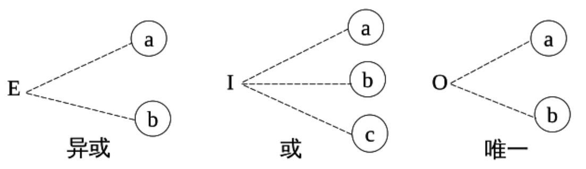

* 异或约束：互不相同
* 或约束：至少有一个成立
* 唯一约束：有且只有一个成立

#### （2）因果图的设计步骤
* 确定软件规格中的原因和结果
  * 分析哪些是原因，哪些是结果，并给每个原因和结果赋予一个标识符
  * 要把原因、结果各自的内部单独开，不要使原因结果内部存在或的关系
* 确定原因和结果之间的逻辑关系
  * 分析软件规格说明中的语义
  * 找出原因和结果之间、原因与原因之间对应的关系
  * 根据这些关系画出因果图
* 确定因果图中的各个约束
  * 在因果图上用一些记号表明约束或限制条件
* 将因果图转化为决策表
* 根据决策表生成测试用例

### 5.决策表
**在所有的黑盒测试方法中，基于决策表的测试是最严格、最具有逻辑性的测试方法。**
> &emsp;&emsp;决策表是把作为条件的所有输入的各种组合值以及对应输出值都罗列出来而形成的表格。  
> &emsp;&emsp; 将复杂的问题按照各种可能的情况全部列举出来，简明并避免遗漏。

#### （1）决策表的组成
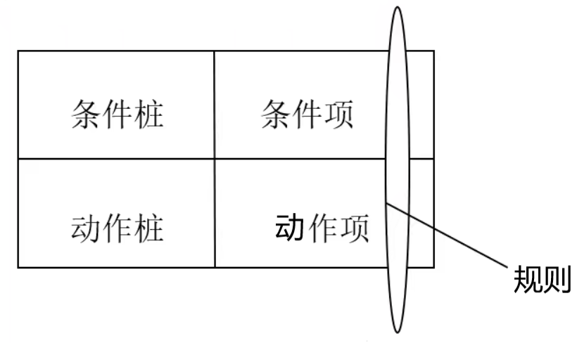

#### （2）构造及简化

## 三、软件测试自动化

 

 dasdas 